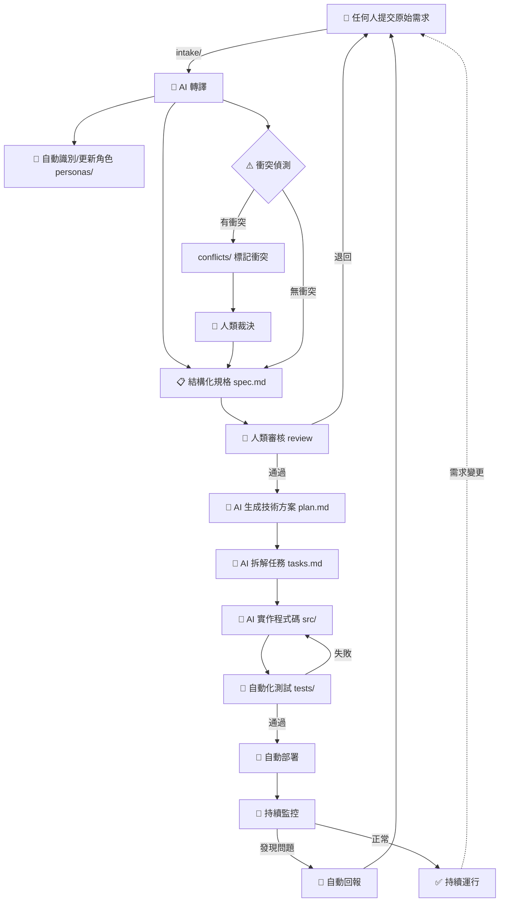

# 需求驅動設計開發（Demand-Driven AI Development）

## 這個專案是做什麼的？

**你不需要懂任何技術，只需要說出你想要什麼。**

這個專案讓任何人都能提出需求——不管你是老闆、業務、客服還是使用者，你只要用你自己的話說出「我想要什麼」，AI 就會自動幫你把想法變成可以開發的規格，最終變成真正能用的軟體。

你不需要：
- ❌ 學習任何技術知識
- ❌ 寫正式的「需求文件」
- ❌ 用特定的格式或模板
- ❌ 和工程師反覆溝通

你只需要：
- ✅ 說出你的想法

---

## 我該怎麼提需求？3 步驟超簡單

### 第 1 步：說出你想要什麼
用你自己的話就好。可以是一句話、一段對話、一份會議紀錄，甚至是一張截圖加幾句說明。

### 第 2 步：AI 會幫你整理
AI 會自動把你說的話整理成結構化的規格，包含不同使用者的需求、可能的衝突等等。

### 第 3 步：你來確認
AI 整理好之後，會請你（或負責人）看一下是否正確。確認之後，AI 就會開始開發。

就這麼簡單！

---

## 流程總覽



### 流程說明

| 階段 | 誰負責 | 做什麼 |
|------|--------|--------|
| 提需求 | **你** | 用任何方式說出你想要什麼 |
| 轉譯 | AI | 把你的話整理成結構化規格 |
| 衝突偵測 | AI | 找出不同角色之間的需求矛盾 |
| 裁決衝突 | **人類** | 決定衝突怎麼解決 |
| 審核 | **人類** | 確認 AI 整理的規格是否正確 |
| 開發 | AI | 自動寫程式 |
| 測試 | AI | 自動測試，有問題自動修正 |
| 部署 | AI + **人類** | 自動部署，正式環境需要人確認 |
| 監控 | AI | 持續監控，發現問題自動回報成新需求 |
| 迭代 | **你** | 想改什麼隨時說，流程會重新跑 |

---

## 專案結構簡介

| 資料夾 | 用途 |
|--------|------|
| `intake/` | 📥 放你的原始需求（任何人都可以放） |
| `personas/` | 👥 使用者角色定義 |
| `specs/` | 📋 AI 整理好的結構化規格 |
| `conflicts/` | ⚠️ 需求衝突紀錄 |
| `reviews/` | ✅ 審核紀錄 |
| `src/` | 💻 AI 生成的程式碼 |
| `tests/` | 🧪 自動化測試 |
| `infra/` | 🏗️ 基礎設施定義（自動部署用） |
| `docs/` | 📖 專案文件 |

---

## 快速開始

準備好了嗎？你的第一步就是提出你的需求！

在 Claude Code 中執行：

```
/intake
```

AI 會引導你完成整個流程。不用緊張，怎麼說都可以，AI 會幫你整理好的。
