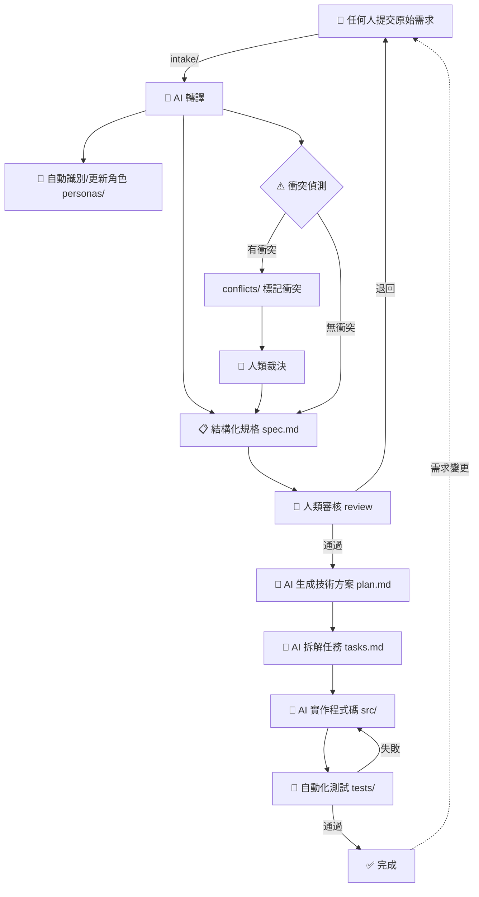
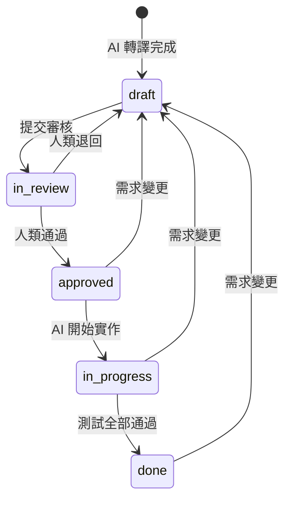

# 完整工作流程

## 流程總覽

## 各階段詳細說明

### 1. 需求收集（Intake）
- **負責人**：任何人
- **輸入**：自然語言、會議紀錄、截圖、語音轉文字...任何格式
- **輸出**：`intake/raw/YYYY-MM-DD-{slug}.md`
- **命令**：`/intake`

### 2. AI 轉譯（Translate）
- **負責人**：AI
- **輸入**：原始需求檔案
- **輸出**：`specs/{feature}/spec.md`（狀態：`draft`）+ 角色更新
- **命令**：`/translate`

### 3. 衝突偵測（Detect Conflicts）
- **負責人**：AI
- **輸入**：spec.md 中的 User Stories
- **輸出**：`conflicts/CONFLICT-{NNN}.md`
- **命令**：`/detect-conflicts`

### 4. 人類裁決（Resolve Conflicts）
- **負責人**：人類
- **輸入**：衝突紀錄和 AI 分析
- **輸出**：衝突狀態更新為 `resolved`

### 5. 人類審核（Review）
- **負責人**：人類
- **輸入**：spec.md
- **輸出**：`reviews/REVIEW-{feature}-{date}.md` + 狀態更新為 `approved`
- **命令**：`/review`

### 6. 技術方案（Plan）
- **負責人**：AI
- **輸入**：已審核的 spec.md
- **輸出**：`specs/{feature}/plan.md` + `specs/{feature}/tasks.md`
- **命令**：`/plan`

### 7. AI 實作（Implement）
- **負責人**：AI
- **輸入**：plan.md + tasks.md
- **輸出**：`src/` 程式碼 + `tests/` 測試
- **命令**：`/implement`

### 8. 迭代（Iterate）
- **負責人**：任何人（發起）+ AI（分析）+ 人類（審核）
- **輸入**：變更描述
- **輸出**：影響分析 + 更新的 specs
- **命令**：`/iterate`

## 狀態流轉圖

