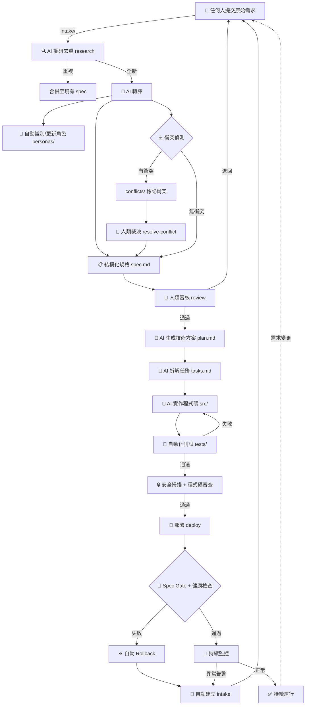
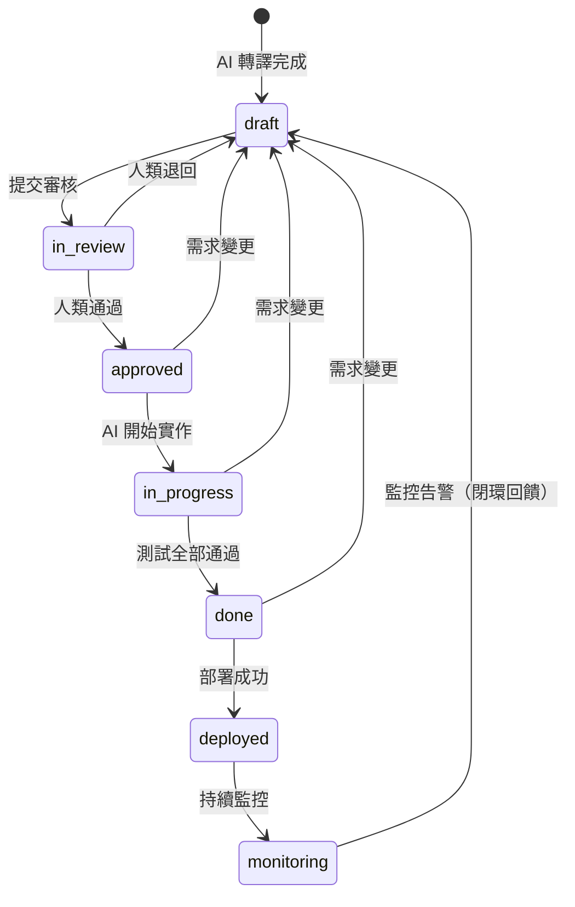
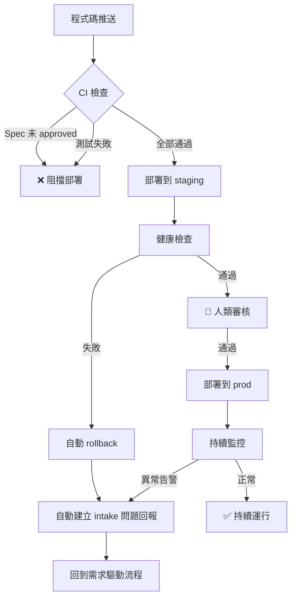

# 完整工作流程

## 流程總覽

## 各階段詳細說明

### 1. 需求收集（Intake）
- **負責人**：任何人
- **輸入**：自然語言、會議紀錄、截圖、語音轉文字...任何格式
- **輸出**：`intake/raw/YYYY-MM-DD-{slug}.md`
- **命令**：`/intake`

### 2. 調研去重（Research）
- **負責人**：AI
- **輸入**：原始需求檔案
- **輸出**：`specs/{feature}/research.md`（去重結果 + 可行性評估）
- **命令**：`/research`
- **關鍵功能**：
  - 掃描所有現有 specs 進行去重檢查
  - 可行性評估（技術風險、安全性、資料庫變更）
  - 相關程式碼與基礎設施的影響分析
  - 若發現重複，建議合併而非新建

### 3. AI 轉譯（Translate）
- **負責人**：AI
- **輸入**：原始需求檔案 + research.md
- **輸出**：`specs/{feature}/spec.md`（狀態：`draft`）+ 角色更新
- **命令**：`/translate`

### 4. 衝突偵測（Detect Conflicts）
- **負責人**：AI
- **輸入**：spec.md 中的 User Stories
- **輸出**：`conflicts/CONFLICT-{NNN}.md`
- **命令**：`/detect-conflicts`

### 5. 人類裁決（Resolve Conflicts）
- **負責人**：人類（AI 引導）
- **輸入**：衝突紀錄和 AI 分析
- **輸出**：衝突狀態更新為 `resolved`
- **命令**：`/resolve-conflict`
- **關鍵功能**：
  - 結構化的決策框架（影響矩陣、取捨分析）
  - AI 提供建議但不做決策
  - 要求人類記錄決策理由
  - 自動更新所有相關文件（衝突記錄 + spec + changelog）

### 6. 人類審核（Review）
- **負責人**：人類
- **輸入**：spec.md（含安全性需求區塊）
- **輸出**：`reviews/REVIEW-{feature}-{date}.md` + 狀態更新為 `approved`
- **命令**：`/review`

### 7. 技術方案（Plan）
- **負責人**：AI
- **輸入**：已審核的 spec.md + research.md
- **輸出**：`specs/{feature}/plan.md`（含資料模型變更 + 安全性考量）+ `specs/{feature}/tasks.md`
- **命令**：`/plan`

### 8. AI 實作（Implement）
- **負責人**：AI
- **輸入**：plan.md + tasks.md
- **輸出**：`src/` 程式碼 + `tests/` 測試
- **命令**：`/implement`

### 9. 安全掃描 + 程式碼審查（Security & Code Review）
- **負責人**：AI（掃描）+ 人類（審查）
- **輸入**：AI 生成的程式碼
- **輸出**：安全掃描報告 + 程式碼審查結果
- **關鍵功能**：
  - 自動掃描硬編碼密鑰
  - 依賴項漏洞掃描
  - 人類審查程式碼品質與安全性
  - Hotfix 場景可延後審查（24 小時內完成）

### 10. 部署（Deploy）
- **負責人**：AI（自動）+ 人類（prod 審核）
- **輸入**：通過安全掃描和審查的程式碼
- **輸出**：部署到目標環境
- **命令**：`/deploy`
- **閉環機制**：
  - CI 檢查 spec 是否已 approved（Spec Gate）
  - 安全掃描通過
  - 部署後執行健康檢查
  - 失敗自動 rollback + 建立 intake

### 11. 監控與回饋（Monitor & Feedback）
- **負責人**：自動化系統
- **輸入**：部署後的系統指標
- **輸出**：告警 → 自動建立 `intake/raw/` 問題回報
- **命令**：`/feedback`
- **閉環機制**：
  - 監控告警自動轉為 intake 項目
  - 30 分鐘內重複告警自動去重
  - 24 小時內 3 次以上相同告警自動升級

### 12. 迭代（Iterate）
- **負責人**：任何人（發起）+ AI（分析）+ 人類（審核）
- **輸入**：變更描述
- **輸出**：影響分析 + 更新的 specs
- **命令**：`/iterate`

## 狀態流轉圖

## 閉環部署流程

## 部署環境

| 環境 | 自動部署 | 需人工審核 | 回饋迴路 |
|------|---------|-----------|---------|
| dev | 每次 push | 否 | 可選 |
| staging | PR 合併 | 否 | 啟用 |
| prod | 手動觸發 | **是** | **必須啟用** |
