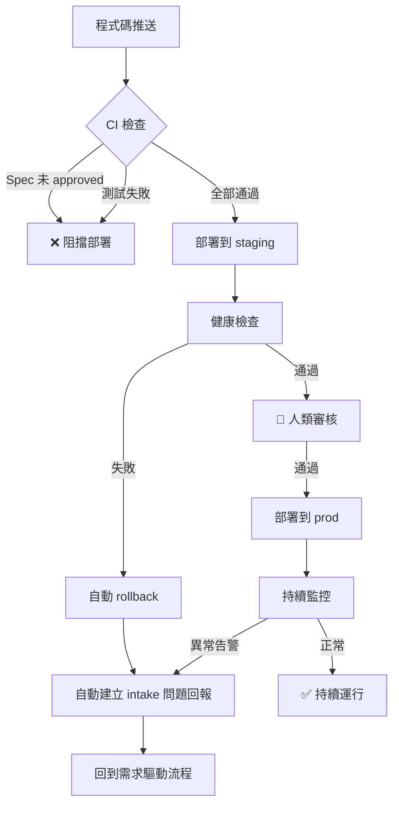

# 🏗️ Infrastructure as Code (IaC) — 閉環部署

## 這是什麼？

這個資料夾包含所有基礎設施的程式化定義。我們不用手動設定伺服器，而是用程式碼來描述「我要什麼樣的環境」，然後自動建立。

## 閉環（Closed-Loop）是什麼意思？

一般的開發流程到「部署上線」就結束了。但我們的流程是一個**閉環**：

```
需求 → 開發 → 部署 → 監控 → 發現問題 → 自動回報需求 → 再開發 → ...
```

也就是說，系統上線後如果有問題，監控機制會**自動產生一筆新的需求**回到 `intake/`，讓整個流程重新跑起來。不需要有人手動回報。

## 資料夾結構

```
infra/
├── terraform/              # 基礎設施定義（伺服器、資料庫、網路等）
│   ├── main.tf             # 主要資源定義
│   ├── variables.tf        # 可調整的參數
│   ├── outputs.tf          # 部署後的輸出資訊
│   ├── providers.tf        # 雲端供應商設定
│   └── environments/       # 不同環境的參數
│       ├── dev.tfvars      # 開發環境
│       ├── staging.tfvars  # 預備環境
│       └── prod.tfvars     # 正式環境
├── docker/
│   ├── Dockerfile          # 應用程式容器定義
│   └── docker-compose.yml  # 本地開發用的容器編排
└── monitoring/
    ├── alerts.yml          # 告警規則定義
    └── feedback-loop.yml   # 閉環回報設定（監控 → intake）
```

## 部署環境

| 環境 | 用途 | 部署方式 |
|------|------|----------|
| `dev` | 開發測試 | 每次 push 自動部署 |
| `staging` | 預備驗證 | PR 合併到 main 自動部署 |
| `prod` | 正式上線 | 需人類審核後手動觸發 |

## 閉環部署流程


