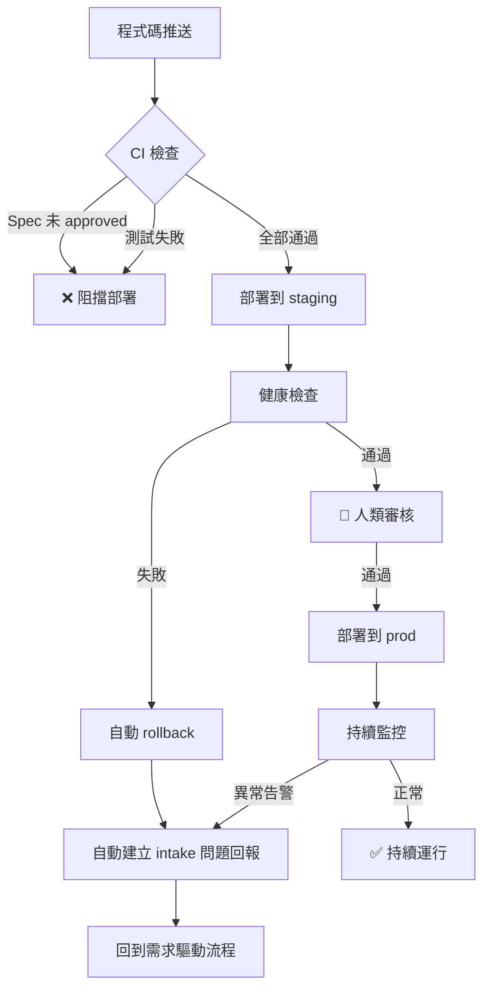

# 基礎設施 — AI 驅動的閉環部署

## 設計理念

**使用者不需要懂基礎設施。** AI 透過 API 自動完成所有設定與管理。

```
使用者只需要：                     AI 自動完成：
1. 安裝 Coolify（一行指令）        → 建立專案、環境、應用程式
2. 給 AI 一個 API Token           → 建立資料庫、Redis
3. 說「幫我架好環境」              → 設定域名、SSL、環境變數
                                   → 部署、監控、回滾
                                   → 失敗時自動回報需求
```

## 閉環（Closed-Loop）是什麼意思？

一般的開發流程到「部署上線」就結束了。但我們的流程是一個**閉環**：

```
需求 → 開發 → 部署 → 監控 → 發現問題 → 自動回報需求 → 再開發 → ...
```

系統上線後如果有問題，監控機制會**自動產生一筆新的需求**回到 `intake/`，讓整個流程重新跑起來。不需要有人手動回報。

## 部署方案

| 方案 | 適用場景 | 管理方式 |
|------|----------|----------|
| **Coolify（推薦）** | 自架伺服器、地端部署 | AI 透過 API 全自動控制 |
| **Terraform + AWS** | 雲端部署 | 需手動設定 |

### 為什麼推薦 Coolify？

- **零手動操作**：AI 透過 API 建立、部署、管理所有資源
- **一台伺服器就夠**：不需要 AWS 帳號或雲端費用
- **完整 API**：50+ 端點涵蓋 projects / apps / databases / services / deployments
- **內建 SSL**：自動 Let's Encrypt
- **框架深度整合**：`/setup`、`/deploy`、`/infra` 命令直接控制

## 資料夾結構

```
infra/
├── coolify/                    # Coolify 自架 PaaS（AI 控制） ★ 推薦
│   ├── api.sh                  #   API 客戶端函式庫（50+ 函數）
│   ├── deploy.sh               #   部署腳本（CI/CD + AI 共用）
│   ├── config.local.example.yml#   設定範本（/setup 自動產生）
│   └── README.md               #   詳細指南
├── terraform/                  # AWS 雲端方案（備用）
│   ├── main.tf                 #   主要資源定義
│   ├── variables.tf            #   可調整的參數
│   ├── outputs.tf              #   部署後的輸出資訊
│   ├── providers.tf            #   雲端供應商設定
│   └── environments/           #   不同環境的參數
│       ├── dev.tfvars
│       ├── staging.tfvars
│       └── prod.tfvars
├── docker/
│   ├── Dockerfile              # 應用程式容器定義
│   └── docker-compose.yml      # 本地開發用的容器編排
└── monitoring/
    ├── alerts.yml              # 告警規則定義
    ├── prometheus-local.yml    # Prometheus 本地設定
    └── feedback-loop.yml       # 閉環回報設定（監控 → intake）
```

## AI 命令

| 命令 | 用途 | 說明 |
|------|------|------|
| `/setup` | 初始化 | AI 引導連線 → 自動建立所有資源 |
| `/deploy [env]` | 部署 | 閉環部署（spec gate → 部署 → 健康檢查 → 回饋） |
| `/infra status` | 查看狀態 | 所有資源的即時狀態 |
| `/infra add db` | 新增資料庫 | AI 建立 + 自動設定連線 |
| `/infra logs` | 查看日誌 | 應用程式日誌 |
| `/infra env set` | 環境變數 | 設定 / 批次更新 |
| `/infra backup` | 備份 | 資料庫備份管理 |

## 部署環境

| 環境 | 用途 | 部署方式 | 策略 |
|------|------|----------|------|
| `dev` | 開發測試 | 每次 push 自動 | Direct |
| `staging` | 預備驗證 | PR 合併到 main | Rolling |
| `prod` | 正式上線 | 需人類審核 | Canary / Blue-Green |

## 閉環部署流程



## Coolify API 控制流程

```
使用者                     AI (Claude Code)                 Coolify Server
  │                             │                                │
  │  /setup                     │                                │
  │ ──────────────────────→     │  GET  /health                  │
  │                             │  GET  /servers                 │
  │                             │  POST /projects                │
  │                             │  POST /projects/{}/environments│
  │                             │  POST /applications/public     │
  │                             │  POST /databases/postgresql    │
  │                             │  POST /applications/{}/envs    │
  │                             │  POST /applications/{}/start   │
  │                             │ ──────────────────────────→    │
  │  「全部建好了」              │                                │
  │ ←──────────────────────     │                                │
  │                             │                                │
  │  /deploy staging            │                                │
  │ ──────────────────────→     │  POST /deploy                  │
  │                             │  GET  /deployments/{uuid}      │
  │                             │ ──────────────────────────→    │
  │  「staging 部署成功」        │                                │
  │ ←──────────────────────     │                                │
  │                             │                                │
  │  /infra add db redis        │                                │
  │ ──────────────────────→     │  POST /databases/redis         │
  │                             │  POST /applications/{}/envs    │
  │                             │ ──────────────────────────→    │
  │  「Redis 建好，已設定連線」  │                                │
  │ ←──────────────────────     │                                │
```
